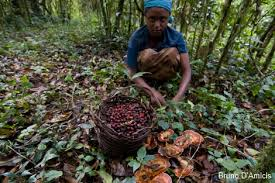

# 🌳 Ikkittino Afforestation Project

**Preserving the Kafa Biosphere through community-driven afforestation and sustainable development.**  
_"Unity for a greener future"_ - Ikkittino

---

## 📜 Overview

The Ikkittino Afforestation Project aims to restore the natural beauty and biodiversity of the Kafa Biosphere Reserve in Ethiopia. This initiative promotes sustainable livelihoods, reduces deforestation, and enhances community awareness to protect this UNESCO-recognized biodiversity hotspot.

*Image: The beautiful landscape of the Kafa Biosphere, home to wild Coffea arabica varieties.*

---

## 🔍 Problem Statement

High rates of deforestation and overgrazing are threatening the delicate ecosystem of the Kafa Biosphere, resulting in habitat loss, reduced biodiversity, and negative socio-economic impacts on local communities.

---

## 🌱 Our Solution

We tackle these challenges through:
1. **Community Awareness Programs**: Educating locals on the importance of preserving the environment.
2. **Sustainable Livelihood Initiatives**: Introducing beekeeping and coffee agroforestry as alternative income sources.
3. **Afforestation and Reforestation**: Planting native tree species and restoring degraded land areas.
4. **Stakeholder Engagement**: Partnering with local government, NGOs, and community groups to support long-term conservation efforts.

---

## 🎯 Project Goals

- Reforest 50 hectares of degraded land in the Kafa Biosphere.
- Plant and nurture 50,000 native tree seedlings over the next 12 months.
- Train 100+ local farmers in sustainable agricultural practices and beekeeping.

---

## 📂 Repository Structure

- `images/`: Folder containing images of project activities and landscapes.
- `docs/`: Documentation related to project planning, research, and reports.
- `src/`: Source code for any tools or applications developed for project support.

---

## 📷 Project Gallery

  
*Image: Community meeting to discuss conservation plans.*

  
*Image: Training session on sustainable beekeeping.*

  
*Image: Coffee plants growing in the Kafa Biosphere, integrating coffee production with conservation.*

---

## 💡 How You Can Contribute

We welcome contributions from anyone interested in making a positive environmental impact. You can support us by:
1. **Raising Awareness**: Share this project with your network.
2. **Contributing Code**: Check the `Issues` tab to see how you can help.
3. **Donating Resources**: Reach out to us for material support or funding opportunities.

---

## 📬 Contact

For any inquiries or collaborations, please reach out to us at:  
- **Email:** danisofu48@gmail.com  
- **Phone:** +251 91 321 0266  

Follow our updates on social media:  
🌐 [Twitter](https://twitter.com/ikkittino)  
🌐 [LinkedIn](https://linkedin.com/in/ikkittino)

---

## 🛠️ Tools & Technologies Used

 
 
 

---

## 📈 Project Status

Currently, the project is in the **Implementation Phase**, focusing on nursery establishment and initial seedling distribution.

---

## 🤝 Acknowledgements

Special thanks to our partners and supporters:  
- **Kafa Zone Environmental Protection Office**  
- **Local Community Leaders**  
- **Supporters from the Cardano Ecosystem**

---

  
*Image: Coffee plants growing in the Kafa Biosphere, integrating coffee production with conservation.*
